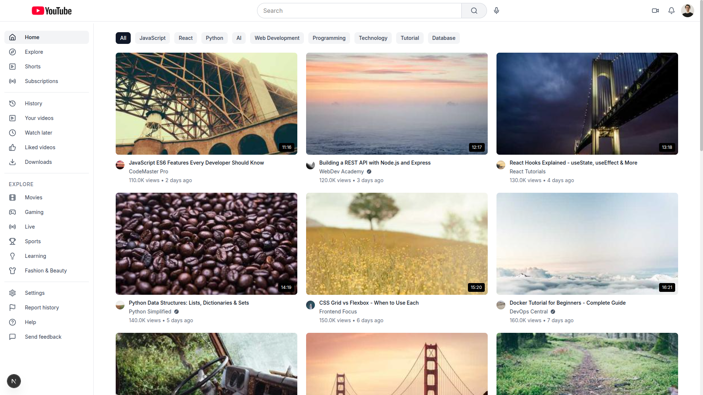
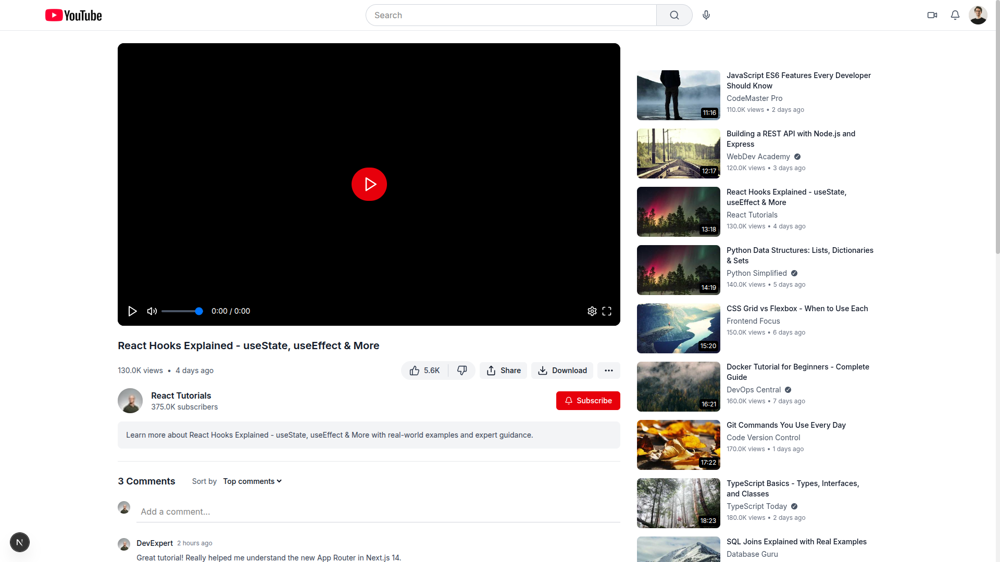
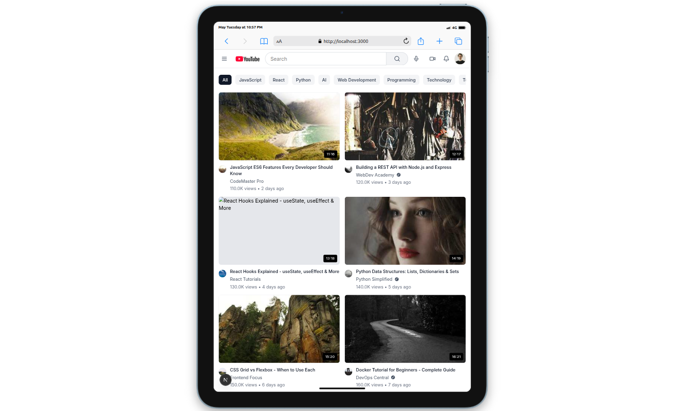
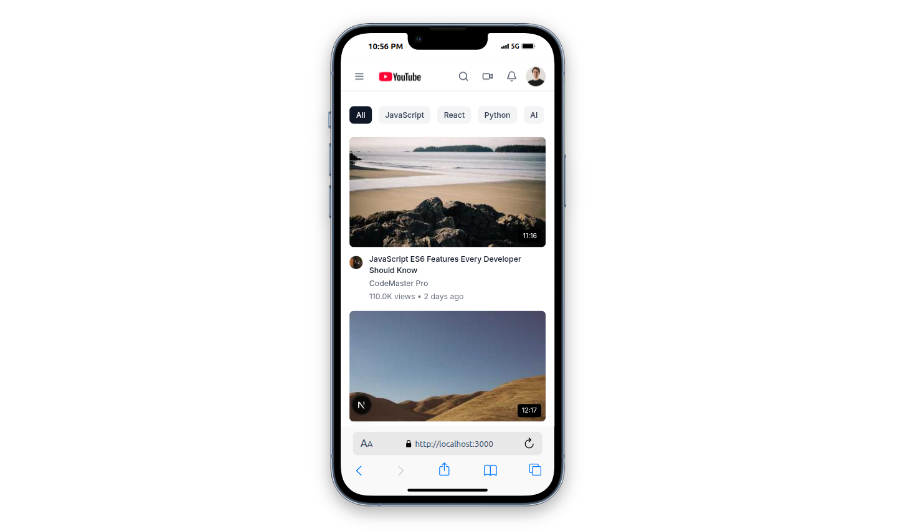

# YouTube Clone - Application

A pixel-perfect YouTube homepage clone built with Next.js, TypeScript, Tailwind CSS, and React Query.

# 📸 Home Page Screenshot



# 📸 Video Details Page Screenshot



# 📸 Responsive for Tablet



# 📸 Responsive for small Devices



## 🚀 Features

- **Pixel-perfect YouTube UI**: Nearly identical to the actual YouTube homepage
- **Responsive Design**: Seamless experience across desktop, tablet, and mobile devices
- **Modern Tech Stack**: Next.js 14, TypeScript, Tailwind CSS, React Query
- **Professional Architecture**: Clean separation of concerns with proper data fetching infrastructure
- **Reusable Components**: Modular component architecture for maintainability
- **Loading States**: Skeleton loaders and error handling
- **Hover Effects**: Interactive video cards with YouTube-like hover animations
- **Accessibility**: Proper ARIA labels, keyboard navigation, and semantic HTML

## Live URL

🔗 [https://bff-youtube-clone-gyn4-tau.vercel.app](https://bff-youtube-clone-gyn4-tau.vercel.app)

## Tech Stack

- **Framework**: Next.js 15 (App Router)
- **Language**: TypeScript
- **Styling**: Tailwind CSS
- **Data Fetching**: TanStack React Query
- **Icons**: Lucide React
- **State Management**: React Hooks + React Query

## 📁 Project Structure

```
youtube-clone/
├── public/                      # Static public assets
│   ├── file.svg
│   ├── globe.svg
│   ├── vercel.svg
│   ├── window.svg
│   └── thumbnails/              # Video thumbnail images
│       ├── video1.jpg
│       └── video2.jpg
├── src/                         # Source code
│   ├── app/                     # Next.js App Router
│   │   ├── favicon.ico
│   │   ├── globals.css          # Global styles
│   │   ├── layout.tsx           # Root layout with providers
│   │   ├── page.tsx             # Homepage
│   │   └── watch/               # Video watch page
│   │       └── page.tsx
│   ├── components/              # Reusable UI components
│   │   ├── common/              # Common utility components
│   │   │   ├── ErrorMessage.tsx
│   │   │   └── LoadingSpinner.tsx
│   │   ├── layout/              # Layout-specific components
│   │   │   ├── Header.tsx
│   │   │   ├── Layout.tsx
│   │   │   └── Sidebar.tsx
│   │   ├── ui/                  # Base UI elements
│   │   │   ├── Avatar.tsx
│   │   │   ├── Button.tsx
│   │   │   └── SearchInput.tsx
│   │   └── video/               # Video-related components
│   │       ├── CommentsSection.tsx
│   │       ├── RelatedVideos.tsx
│   │       ├── VideoCard.tsx
│   │       ├── VideoGrid.tsx
│   │       ├── VideoInfo.tsx
│   │       └── VideoPlayer.tsx
│   ├── lib/                     # Logic and utilities
│   │   ├── api/                 # API client
│   │   │   └── client.ts
│   │   ├── hooks/               # Custom React hooks
│   │   │   ├── useVideoData.ts
│   │   │   └── useVideos.ts
│   │   ├── providers/           # App-wide providers
│   │   │   └── QueryProvider.tsx
│   │   └── utils/               # Utility functions & mock data
│   │       ├── constants.ts
│   │       ├── formatters.ts
│   │       ├── mockComments.ts
│   │       ├── mockVideoData.ts
│   │       └── mockVideos.ts
│   └── types/                   # TypeScript type definitions
│       ├── api.ts
│       └── video.ts
├── README.md
├── eslint.config.mjs
├── next-env.d.ts
├── next.config.ts
├── package.json
├── package-lock.json
├── postcss.config.mjs
├── tailwind.config.js
└── tsconfig.json

```

## 🏃‍♂️ Getting Started

### Prerequisites

- Node.js 18+
- npm or yarn package manager

### Installation

1. **Extract Th Zip file and Change Directory to bff-youtube-clone**

   ```bash
   cd  bff-youtube-clone
   ```

2. **Install dependencies**

   ```bash
   npm install

   ```

3. **Start the development server**

   ```bash
   npm run dev

   ```

4. **Open your browser**
   Navigate to [http://localhost:3000](http://localhost:3000)

### Building for Production

```bash
npm run build
npm start
```

## 🎨 Design Features

### Visual Accuracy

- **Header**: YouTube logo, search bar, user avatar, and navigation icons
- **Sidebar**: Collapsible navigation with proper categorization
- **Video Grid**: Responsive grid layout matching YouTube's spacing
- **Video Cards**: Thumbnail, title, channel info, views, and upload time
- **Hover Effects**: Title bolding and interactive elements

### Responsive Breakpoints

- **Mobile**: < 768px (single column, hidden sidebar)
- **Tablet**: 768px - 1024px (2 columns)
- **Desktop**: 1024px+ (3-5 columns based on screen size)

## 🔧 Configuration

### Environment Variables

Create a `.env.local` file for API configuration:

```env
NEXT_PUBLIC_API_URL= https://youtube-bff.onrender.com
```

## 📱 Responsive Design

The application is fully responsive with:

- **Mobile-First Approach**: Optimized for mobile devices
- **Flexible Grid**: Adapts from 1-5 columns based on screen size
- **Touch-Friendly**: Proper touch targets and interactions
- **Performance**: Optimized images and lazy loading

## 🧪 Testing & Quality

### Code Quality

- **TypeScript**: Full type safety throughout the application
- **ESLint**: Code linting and formatting
- **Accessibility**: ARIA labels and semantic HTML

### Performance Optimizations

- **React Query**: Efficient data fetching and caching
- **Image Optimization**: Next.js image optimization
- **Code Splitting**: Automatic code splitting with Next.js
- **Lazy Loading**: Components and images load as needed

**Built with ❤️ using Next.js, TypeScript, and Tailwind CSS**
